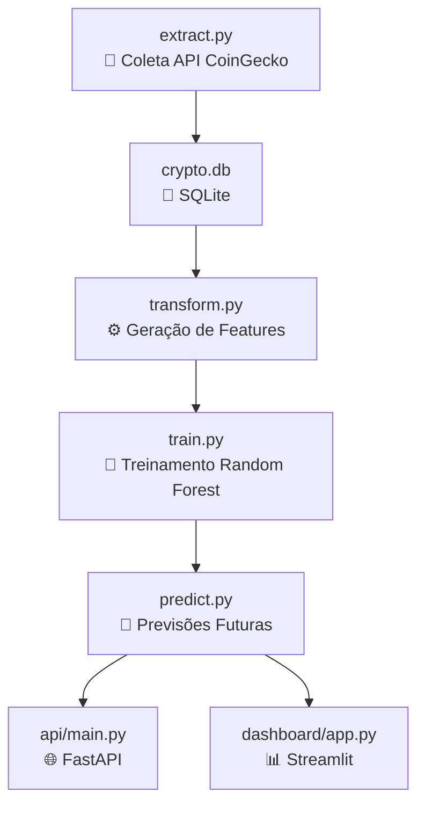

# 📊 Crypto Forecasting Pipeline

Sistema completo de **coleta, processamento, previsão e visualização de preços de criptomoedas** utilizando **Machine Learning**.
O projeto integra **ETL (Extract, Transform, Load)**, **Modelos de Previsão (Random Forest)**, **API REST (FastAPI)** e **Dashboard em tempo real (Streamlit)**.

---

## 🏗️ Arquitetura do Projeto



* **ETL contínuo**: coleta de dados e geração de features.
* **Treinamento periódico**: re-treino automático a cada ciclo.
* **Previsões em tempo real**: atualização a cada 30 segundos.
* **Consumo de dados**: via **API REST** ou **Dashboard interativo**.

---

## 📂 Estrutura de Pastas

```
.
├── etl/
│   ├── extract.py      # Coleta preços da API CoinGecko → SQLite
│   ├── transform.py    # Gera features e salva em Parquet
├── model/
│   ├── train.py        # Treina modelos Random Forest
│   ├── predict.py      # Gera previsões e salva no log
├── api/
│   └── main.py         # API REST com FastAPI
├── dashboard/
│   └── app.py          # Dashboard Streamlit
├── data/
│   ├── crypto.db       # Banco SQLite
│   └── processed/      # Features & previsões (Parquet)
├── models/             # Modelos treinados (joblib)
├── run_all.py          # Orquestrador de processos
├── requirements.txt
└── README.md
```

---

## ⚙️ Instalação

### 🔹 1. Clone o repositório

```bash
git clone https://github.com/seu-usuario/crypto-pipeline.git
cd crypto-pipeline
```

### 🔹 2. Crie o ambiente virtual

```bash
python -m venv venv
source venv/bin/activate   # Linux/Mac
venv\Scripts\activate      # Windows
```

### 🔹 3. Instale as dependências

```bash
pip install -r requirements.txt
```

---

## ▶️ Execução

### 🔹 Rodar todo o sistema

```bash
python run_all.py
```

Esse script orquestra 4 processos independentes:

1. **Coletor contínuo** → `etl/extract.py`
2. **Pipeline periódico (30s)** → `etl/transform.py → model/train.py → model/predict.py`
3. **API FastAPI** → disponível em `http://127.0.0.1:8000/docs`
4. **Dashboard Streamlit** → disponível em `http://127.0.0.1:8501`

O navegador será aberto automaticamente com **API + Dashboard**.

---

## 🌐 API Endpoints

* **Status** → `GET /status`
* **Listar moedas** → `GET /moedas`
* **Prever moeda** → `GET /prever/{moeda}`
* **Histórico de previsões** → `GET /previsoes/{moeda}`

📌 Documentação interativa:

* Swagger UI → [http://127.0.0.1:8000/docs](http://127.0.0.1:8000/docs)
* Redoc → [http://127.0.0.1:8000/redoc](http://127.0.0.1:8000/redoc)

---

## 📊 Dashboard

O dashboard em **Streamlit** oferece:

✅ Histórico de preços em tempo real
✅ Gráficos de previsão para a próxima hora
✅ Métricas de acurácia
✅ Comparativo entre moedas
✅ Exportação de dados para CSV

Acesse em: [http://127.0.0.1:8501](http://127.0.0.1:8501)

---

## ⚡ Tecnologias Utilizadas

* **Python 3.10+**
* **FastAPI** (API REST)
* **Streamlit + Plotly** (Dashboard interativo)
* **Scikit-learn** (Machine Learning)
* **SQLite** (Banco local)
* **Pandas / NumPy** (Manipulação de dados)

---

## 📈 Fluxo de Atualização em Tempo Real

* **A cada 30s** o pipeline roda:

  1. Extrai novos preços
  2. Atualiza features
  3. Re-treina os modelos
  4. Gera previsões
* Dashboard e API **refletem automaticamente os dados mais recentes**.

---

## 🛠️ Diagnóstico

O Dashboard possui seção de diagnóstico que mostra:

* Última atualização dos arquivos
* Quantidade de registros carregados
* Status do log de previsões

