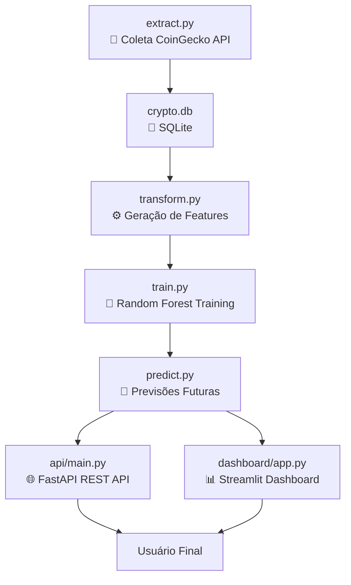

# 🚀 CryptoTech — Crypto Forecasting Pipeline

Um **sistema completo de previsão de preços de criptomoedas em tempo real**, integrando:

* **Coleta automática de dados (ETL)**
* **Treinamento de modelos de Machine Learning (Random Forest)**
* **API REST (FastAPI)**
* **Dashboard interativo (Streamlit)**
  com atualizações automáticas a cada **30 segundos**.

---

## 🧠 Visão Geral

Este projeto implementa um **pipeline de Machine Learning automatizado**, com:

* Extração de preços de criptomoedas via **CoinGecko API**
* Armazenamento em **SQLite**
* Criação de *features* (médias móveis, variação percentual, preço futuro)
* Treinamento incremental de modelos de previsão
* Exposição dos resultados via **API** e **Dashboard**

---

## 🏗️ Arquitetura


```mermaid
flowchart TD
    A[extract.py<br>📡 Coleta CoinGecko API] --> B[crypto.db<br>💾 SQLite]
    B --> C[transform.py<br>⚙️ Geração de Features]
    C --> D[train.py<br>🧠 Random Forest Training]
    D --> E[predict.py<br>🔮 Previsões Futuras]
    E --> F1[api/main.py<br>🌐 FastAPI REST API]
    E --> F2[dashboard/app.py<br>📊 Streamlit Dashboard]
    F1 & F2 --> G[Usuário Final]
```

🔁 O ciclo **ETL + Treinamento + Previsão** roda automaticamente a cada **30 segundos**, garantindo previsões e gráficos sempre atualizados.

---

## 📂 Estrutura de Pastas

```
crypto_tech/
├── etl/
│   ├── extract.py        # Extrai preços da CoinGecko → SQLite
│   ├── transform.py      # Cria features (médias, variações, alvo)
├── model/
│   ├── train.py          # Treina modelos Random Forest
│   ├── predict.py        # Gera previsões e salva no log
├── api/
│   └── main.py           # API REST com FastAPI
├── dashboard/
│   └── app.py            # Dashboard interativo com Streamlit + Plotly
├── data/
│   ├── crypto.db         # Banco local SQLite
│   └── processed/        # Features e previsões (arquivos Parquet)
├── models/               # Modelos salvos (.joblib)
├── run_all.py            # Orquestrador do pipeline completo
├── requirements.txt
└── README.md
```

---

## ⚙️ Instalação

### 1️⃣ Clone o repositório

```bash
git clone https://github.com/seu-usuario/crypto_tech.git
cd crypto_tech
```

### 2️⃣ Crie o ambiente virtual

```bash
python -m venv venv
venv\Scripts\activate    # Windows
# ou
source venv/bin/activate # Linux / macOS
```

### 3️⃣ Instale as dependências

```bash
pip install -r requirements.txt
```

---

## ▶️ Execução

### 🔹 Rodar todo o sistema

```bash
python run_all.py
```

O orquestrador `run_all.py` executa:

1. **ETL completo** → `extract → transform`
2. **Treinamento de modelos** → `train`
3. **Geração de previsões** → `predict`
4. **Serviços paralelos** → `FastAPI` e `Streamlit`

⏱️ O ciclo é repetido automaticamente a cada **30 segundos**, refletindo novas cotações e previsões em tempo real.

---

## 🌐 API — FastAPI

A API REST fornece endpoints para consulta e previsão:

| Endpoint             | Método | Descrição                                     |
| -------------------- | ------ | --------------------------------------------- |
| `/status`            | GET    | Status da API                                 |
| `/moedas`            | GET    | Lista de moedas disponíveis                   |
| `/prever/{moeda}`    | GET    | Retorna previsão de preço para a próxima hora |
| `/previsoes/{moeda}` | GET    | Histórico completo de previsões               |

📘 **Documentação interativa**:

* Swagger UI → [http://127.0.0.1:8000/docs](http://127.0.0.1:8000/docs)
* Redoc → [http://127.0.0.1:8000/redoc](http://127.0.0.1:8000/redoc)

---

## 📊 Dashboard — Streamlit

Interface web em tempo real para visualização das previsões e métricas.

### Funcionalidades:

* Histórico de preços em tempo real 📈
* Previsão 1h à frente 🤖
* Comparativo entre múltiplas criptomoedas 🌍
* Variação percentual entre amostras 📊
* Exportação dos dados em CSV 📩
* Diagnóstico de atualização dos arquivos ⚙️

📍 **Acesse o Dashboard:**
[http://127.0.0.1:8501](http://127.0.0.1:8501)

---

## ⚡ Pipeline de Atualização Contínua

O sistema roda de forma cíclica e automática:

1. 📡 **Extract** → obtém preços da CoinGecko
2. ⚙️ **Transform** → cria features e alvos
3. 🧠 **Train** → re-treina modelos por moeda
4. 🔮 **Predict** → gera novas previsões
5. 📊 **Dashboard/API** → refletem as atualizações instantaneamente

---

## 🧩 Tecnologias Utilizadas

| Categoria                    | Ferramenta                           |
| ---------------------------- | ------------------------------------ |
| **Linguagem**                | Python 3.10+                         |
| **ETL e ML**                 | Pandas, NumPy, scikit-learn, PyArrow |
| **Banco de Dados**           | SQLite                               |
| **API**                      | FastAPI + Uvicorn                    |
| **Dashboard**                | Streamlit + Plotly                   |
| **Agendamento/Orquestração** | threading + subprocess               |
| **Armazenamento de Modelos** | Joblib                               |

---

## 🛠️ Diagnóstico no Dashboard

A seção **“🛠️ Diagnóstico rápido”** exibe:

* Últimas atualizações dos arquivos `.parquet`
* Número de registros carregados
* Status do log de previsões
* Caminhos dos datasets e modelos

---

## 🔒 Boas Práticas e Manutenção

* Execute o projeto sempre dentro de um **ambiente virtual**.
* Mantenha as dependências atualizadas:

  ```bash
  pip install -U -r requirements.txt
  ```
* Monitore o arquivo `logs/run_all_YYYYMMDD.log` para verificar erros ou atrasos no ETL.
* Em caso de inconsistência nos dados, apague o arquivo `crypto_features.parquet` e deixe o ciclo regenerá-lo automaticamente.

